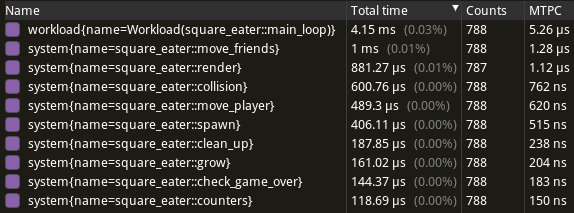

# Tracing

Shipyard comes with a `tracing` feature that let you see and inspect systems execution.

You can use various adapters for the `tracing` crate. I'll use [`tracy`](https://github.com/wolfpld/tracy), a C++ profiler.

We'll need to enable the `tracing` feature and add a few dependencies.\
This can all be feature gated to not impact exported binaries performance.

```toml
shipyard = { git = "https://github.com/leudz/shipyard", features = ["tracing"] }
tracy_full = { version = "1.3", features = ["enable", "tracing"] }
tracing = "0.1"
tracing-subscriber = "0.3.18"
```

Enabling tracing is done by adding a few lines to `main`.

```rust,noplaypen
fn main() {
    use tracing_subscriber::layer::SubscriberExt;

    tracing::subscriber::set_global_default(
        tracing_subscriber::registry().with(tracy_full::tracing::TracyLayer),
    )
    .expect("setup tracy layer");

    // The rest of your main function
}
```

You can download the latest [`tracy` release](https://github.com/wolfpld/tracy/releases), run your program alongside `tracy` which will start registering traces once you click the "connect" button in its interface.

You can then get a quick overview of execution times:



Or more details for specific systems or workloads:

